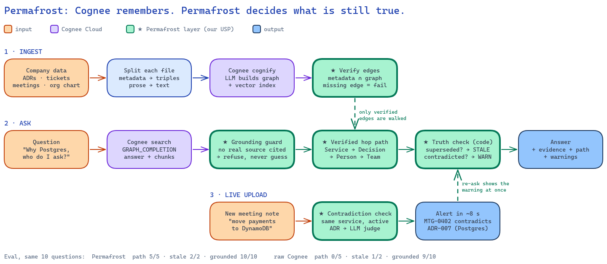

# Permafrost

**Ask why. Get the answer, the evidence, and the path.**

Permafrost is a mini Company Brain: a **verification harness over Cognee**. Cognee remembers; Permafrost checks, time-stamps and measures what it remembers. It connects a company's docs, tickets, meeting notes and org chart into one knowledge graph, then answers natural-language questions with cited evidence and a visible multi-hop path.

## The idea

A new engineer asks, *"Why is payments on Postgres, and who should I talk to about it now?"* The answer exists, but it is scattered: an ADR records the decision, a meeting note records who made it, a ticket records the migration, and the org chart records who owns the service today. No single document holds the whole answer.

Keyword search finds the pieces but not the links between them. Chatbots that answer from vector search alone can produce a confident answer with no trail behind it. Permafrost keeps the links between documents as first-class graph edges, so every answer shows the chain of documents and people it came from.

## What Permafrost does

- **Ingest** four source types from `data/seed/`: ADRs and docs (Markdown), tickets (JSON), meeting notes (Markdown) and the org chart (`team.json`).
- **Add company data from the UI**: the **Data** page takes uploads (several files at once), shows each file's contradiction check and the graph build, syncs the seed folder, and lists every ingested file.
- **Build** a hybrid graph. Metadata becomes canonical structural edges (verified in the graph after ingestion), and Cognee's LLM extraction adds entities, topics and reasoning from prose.
- **Answer** questions through `POST /ask` using Cognee `GRAPH_COMPLETION` retrieval, and refuse when the answer isn't in company knowledge (never guess).
- **Catch contradictions**: drop a new doc and within ~8 s it is checked against the active decisions on the same service (e.g. *MTG-0402 contradicts ADR-007*), naming the decision owner and who raised it.
- **Keep time**: every service has a decision timeline with validity intervals (`GET /timeline?service=payments&as_of=2026-02-15`). A superseded decision is closed, not deleted, so "what was true in February?" still has an answer, and open contradictions show up as proposals.
- **Find the person**: "who should I talk to" is ranked by Personalized PageRank over the verified edges (decisions owned, meetings attended, tickets assigned), not by whoever the LLM names first.
- **Prove it**: a 10-question eval runs against our pipeline, against Cognee with our prompt but none of our layers, and against raw Cognee, side by side in the UI.
- **Show** evidence cards, the hop path (`Service → Decision → Meeting → Person → Team`) and warnings when a cited decision has been superseded.
- **Explore** the graph and the ingested sources directly.

## A harness, not a wrapper

A wrapper forwards calls. A harness constrains, checks and measures the engine inside it, and rejects its output when a check fails.

| Cognee does | The Permafrost harness does |
|---|---|
| Chunking, entity extraction (`cognify`) | Verifies every structural edge against source metadata; ingest fails if an expected edge is missing |
| Graph + vector storage | Drops false LLM edges from paths (seen: "ADR-007 affects svc-reports"); only `metadata ∩ graph` edges are walked |
| `GRAPH_COMPLETION` retrieval | Refuses answers that cite no retrieved source; reports `unsupported_citations` |
| Answer generation | Adds what a prompt cannot: the verified hop path, stale and contradiction warnings, the decision timeline, the ranked people to ask |
| | Measures itself: the same 10 questions against raw Cognee and against Cognee + our prompt ([Eval](#eval)) |

All Cognee traffic goes through one module, `backend/app/cognee_client.py`; everything else in `backend/app/` is the harness. The timeline, contradiction candidates and expert ranking make no Cognee calls at all.

## Structure from metadata. Meaning from the LLM.

Permafrost does not rely on the LLM to invent the relationships its answers depend on.

- The edges used in the multi-hop demo (`attended_by`, `assigned_to`, `member_of`, `owns`, `led_by`, `decided_in`, `affects`, `owned_by`, `supersedes`, `references`, `produced`, `proposes_change_to`) come from source metadata and canonical IDs, and ingestion fails if any expected edge is missing from the graph.
- The LLM handles only prose: entities, topics and the reasoning behind decisions. Those entities are then linked back to the canonical nodes.
- A grounding guard answers only from retrieved context. Each answer carries `evidence[]`, `path[]`, `warnings[]`, `experts[]` and `unsupported_citations[]` (IDs the answer cites that were not in the retrieved context), and a supersede check flags stale decisions.
- A new doc does not need hand-written `proposals:` frontmatter to raise a contradiction: without it, one LLM call extracts the claims (restricted to known service IDs, capped at 3), then the same deterministic candidate filter and judge run. Try `docs/demo/MTG-0409.md`.



Purple is Cognee; green is the Permafrost harness. Source: [`docs/workflow.excalidraw`](docs/workflow.excalidraw).

## Architecture


The Next.js frontend talks to a FastAPI backend over REST. The backend calls Cognee Cloud over REST; the graph, vector and metadata stores and the LLM are managed by the Cognee Cloud tenant, so no database server runs locally. App state such as question history and feedback lives in a separate SQLite file (`app.db`) accessed with Python's built-in `sqlite3`. Cognee Cloud is configured with `COGNEE_SERVICE_URL` and `COGNEE_API_KEY` in `backend/.env`; contradiction alerts also need `LLM_MODEL` / `LLM_API_KEY` (a direct OpenAI call for the judge).

The full design is in [`docs/architecture.md`](docs/architecture.md): ingestion pipeline, graph schema, query sequence, reliability plan and scale-out path. The diagram source is [`docs/architecture.excalidraw`](docs/architecture.excalidraw).

## Built with

- Next.js, React, TypeScript and Tailwind CSS
- Python, FastAPI and uv
- Cognee Cloud (REST API; managed graph, vector store and LLM)

## Status

All build phases are done ([`docs/plan.md`](docs/plan.md), per-phase results in [`docs/phases/`](docs/phases/)): Cognee Cloud ingestion, `POST /ask` with evidence and a verified hop path, the frontend, contradiction alerts with live upload, the eval with a raw-Cognee baseline, an MCP tool for agents, and a cached fallback for the demo questions.

## Run locally

Prerequisites: Node.js 20+, npm, [uv](https://docs.astral.sh/uv/) and Python 3.12+.

```bash
bash scripts/init.sh                                   # deps + .env files; then fill COGNEE_* (and LLM_*) in backend/.env
(cd backend && uv run python -m app.ingest --reset)    # build the graph once (~5 min)
bash scripts/dev.sh                                    # backend :8000 + frontend :3000
```

Open http://localhost:3000. The API runs on http://localhost:8000, with interactive docs at http://localhost:8000/docs.

```bash
cd frontend && npx tsc --noEmit && npm run lint && npm run build
```

## Use from an agent

The repo's `.mcp.json` registers an MCP server with one tool, `ask_company_brain(question)`, which calls `POST /ask` and returns the same answer, evidence, path and warnings as the UI. Start the backend, then open the repo in Claude Code (or any MCP client) and ask it a company question.

## Eval

```bash
cd backend && uv run python -m eval.run_eval              # our pipeline, 10 questions
cd backend && uv run python -m eval.run_eval --baseline   # the same questions through raw Cognee
cd backend && uv run python -m eval.run_eval --baseline prompted   # ablation: Cognee + our system prompt, none of our layers
```

Both runs are stored in `app.db` and served at `GET /eval/latest` (the UI's eval badge).

Latest run:

| Variant | Grounded | Expected refs cited | Stale flagged | Verified path | Hallucinated sources |
|---|---|---|---|---|---|
| Permafrost | 10/10 | 100% | 2/2 | 5/5 | 0 |
| Cognee + our prompt, no layers | 10/10 | 100% | 1/2 | 0/5 | 0 |
| Raw Cognee | 9/10 | 55% | 1/2 | 0/5 | 0 |

The ablation row keeps us honest: the system prompt alone buys the grounding and citation numbers. What the code layers add is the verified path, the stale flag, contradiction alerts, the timeline and the expert ranking, none of which a prompt can produce.

## Demo

The 2-minute script is in [`docs/plan.md` §7](docs/plan.md#7-demo-script-2-minutes-judging-round): the showcase question (4-hop path + stale warning), a refusal, dropping `data/live/MTG-0402.md` (contradiction alert in ~8 s), the re-ask with the contradiction warning, then the eval badge.

```bash
bash scripts/restore_demo.sh save   # once, after the final ingest + eval: snapshot app.db
bash scripts/restore_demo.sh        # before each run, backend stopped: restore app.db, un-ingest MTG-0402
```

If Cognee Cloud is slow or down, a question that was answered before is served from the last answer (flagged `cached: true`); ask one question at a time, since concurrent Cloud searches slow down sharply.

## Research we build on

Permafrost adapts ideas from these papers; none is reimplemented in full.

| Paper | Idea we took | Where |
|---|---|---|
| Rasmussen et al., *Zep: A Temporal Knowledge Graph Architecture for Agent Memory*, [arXiv 2501.13956](https://arxiv.org/abs/2501.13956) | Facts carry validity intervals; a contradicted fact is closed, not deleted | `backend/app/analysis/timeline.py`, `GET /timeline` |
| Gutiérrez et al., *HippoRAG: Neurobiologically Inspired Long-Term Memory for LLMs*, NeurIPS 2024, [arXiv 2405.14831](https://arxiv.org/abs/2405.14831) | Personalized PageRank over a knowledge graph, seeded by the query's entities | `paths.rank_people` (expert finder) |
| Es et al., *Ragas: Automated Evaluation of Retrieval Augmented Generation*, [arXiv 2309.15217](https://arxiv.org/abs/2309.15217) | Faithfulness: an answer's claims must be supported by the retrieved context | `ask.unsupported_citations`, grounding guard (deterministic, ID-level) |
| Gao et al., *Enabling LLMs to Generate Text with Citations* (ALCE), [arXiv 2305.14627](https://arxiv.org/abs/2305.14627) | Citation quality as a metric of its own | eval columns: expected refs cited, hallucinated sources |
| Li et al., *ContraDoc: Understanding Self-Contradictions in Documents with LLMs*, [arXiv 2311.09182](https://arxiv.org/abs/2311.09182) | LLMs are unreliable at finding contradictions across whole documents | decision D6: deterministic candidates, then the LLM judges one claim against one decision |
| Tang & Yang, *MultiHop-RAG: Benchmarking RAG for Multi-Hop Queries*, [arXiv 2401.15391](https://arxiv.org/abs/2401.15391) | Multi-hop and unanswerable ("null") queries need their own eval cases | `backend/eval/questions.json` kinds: multi-hop, single-hop, refusal, stale |

## Decisions and scope

- Decision log (D1–D8, with rejected alternatives): [`docs/plan.md` §4](docs/plan.md#4-key-design-decisions-for-the-decision-log-slide)
- Cut on purpose: real Slack/Jira connectors, auth and permissions, a graph editing UI, cloud deploy with autoscaling. Full scope table: [`docs/plan.md` §5](docs/plan.md#5-scope)
