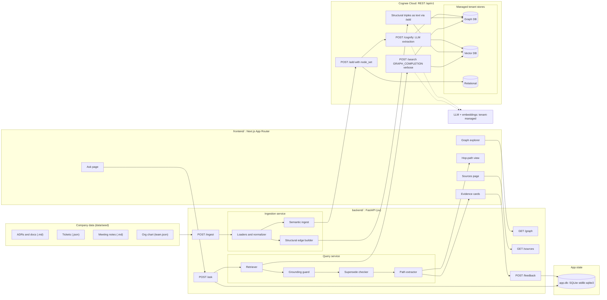
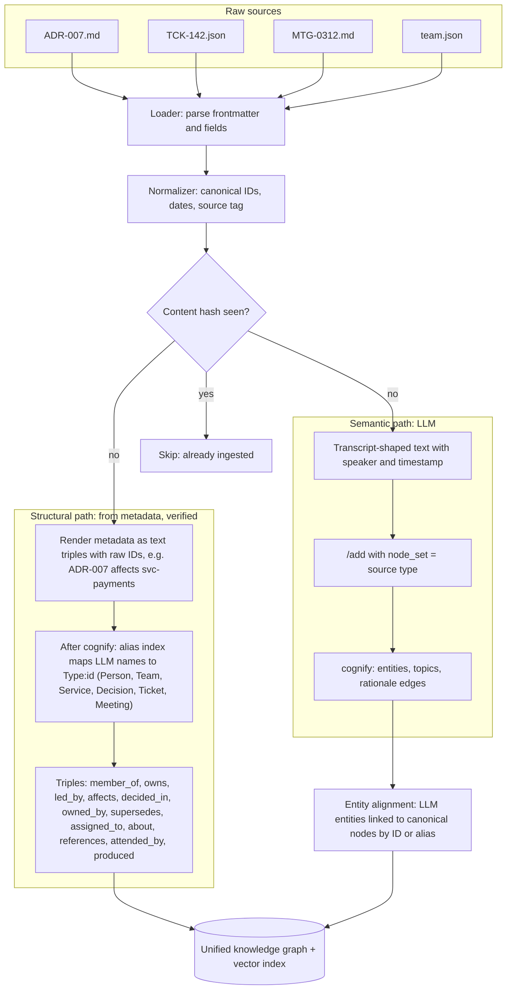
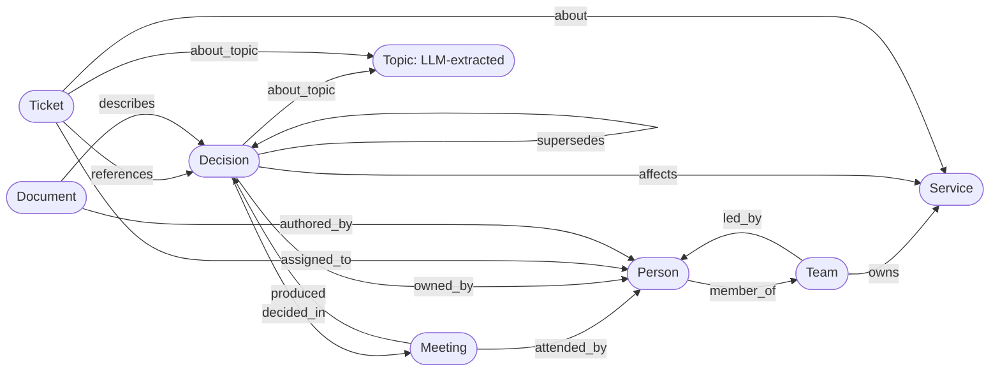
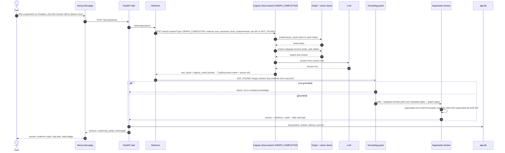
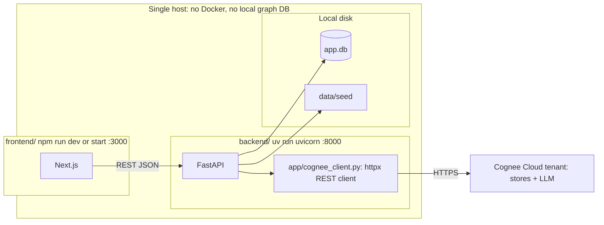
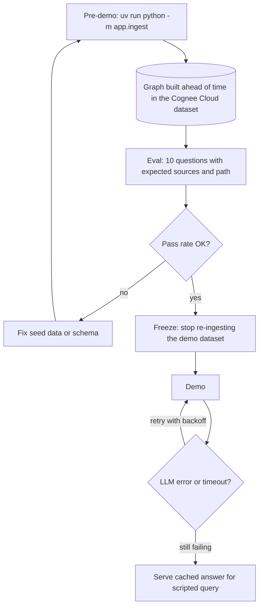

# Permafrost: Technical Architecture

A mini Company Brain on **Cognee**. It ingests docs, tickets and meeting notes into a hybrid graph+vector knowledge layer and answers natural-language questions with **evidence** and a **visible multi-hop path**.

> **Full diagram:** [`architecture.excalidraw`](architecture.excalidraw) (open at excalidraw.com), with a PNG preview at [`architecture.png`](architecture.png).
>
> **Excalidraw:** every diagram below is a Mermaid `flowchart` or `sequenceDiagram`, the two types Excalidraw's converter supports. In Excalidraw, open **More tools → Mermaid to Excalidraw** and paste a block.
> Cognee APIs were confirmed in the Phase 0 spike ([phase-0](phases/phase-0-setup-and-spike.md), S1–S9) against **Cognee Cloud** REST (`/api/v1/*`), using SDK 1.6.0 for reference.

---

## 1. System overview



### Components

| Layer | Component | Responsibility |
|---|---|---|
| Data | `data/seed/` | One consistent fictional company with 30–50 items and **canonical IDs** shared across sources |
| Frontend | Next.js App Router | Ask UI, evidence cards, hop-path rendering, graph explorer |
| Backend | FastAPI | HTTP API, ingestion orchestration, query pipeline, grounding rules |
| Knowledge | Cognee | Graph + vector memory, LLM extraction, graph-completion retrieval |
| Stores | Cognee Cloud tenant | Managed graph, vector and relational stores, reached over REST |
| App state | `app.db` (stdlib `sqlite3`) | Ingested sources (hash, Cognee data_ids), aliases, Q&A history, feedback, alerts, eval runs |
| Model | Cognee Cloud tenant | LLM and embeddings are configured on the tenant, not in our `.env` |

---

## 2. Ingestion pipeline (hybrid graph construction)

The core design decision is that **structure comes from metadata and meaning comes from the LLM**. Edges that the multi-hop demo depends on are generated from metadata as canonical triples, and after `cognify` each one is verified in `GET /datasets/{id}/graph`. A missing edge fails ingestion instead of quietly breaking the demo.



### Source → graph mapping

| Source | Format | Structural edges (metadata) | Semantic content (LLM) |
|---|---|---|---|
| ADR / docs | Markdown + YAML frontmatter (`id`, `status`, `decided_in`, `affects`, `supersedes`, `owner`) | `Decision -affects-> Service`, `Decision -supersedes-> Decision`, `Decision -decided_in-> Meeting`, `Decision -owned_by-> Person` | Rationale, alternatives, trade-offs |
| Tickets | JSON (`id`, `title`, `assignee`, `service`, `refs`, `status`) | `Ticket -assigned_to-> Person`, `Ticket -about-> Service`, `Ticket -references-> Decision` | Problem description, discussion |
| Meeting notes | Markdown (`date`, `title`, `attendees`, `decisions`) | `Meeting -attended_by-> Person`, `Meeting -produced-> Decision` | Who argued what, open questions |
| Org chart | JSON | `Person -member_of-> Team`, `Team -owns-> Service`, `Team -led_by-> Person` | A short `[ORG CHART]` text doc (who leads what, aliases) |

---

## 3. Graph schema



Cognee Cloud has no REST route for custom `DataPoint`s (`add_data_points` is in-process only; spike S3). Structural edges are therefore sent as canonical text triples into `/add` (`node_set=structural`), and P1 checks that every expected edge exists in `GET /datasets/{id}/graph`. A `/cognify` `graphModel` JSON schema can type the nodes if needed. Citations come from the `DocumentChunk`s in the search result: each chunk's `TextDocument` is named after our upload filename (the ref, e.g. `ADR-007`), which `app.db` `sources.ref` maps back to the seed file. Chunks from triples docs are not used as evidence.

`cognify` also creates its own node types alongside ours: `TextDocument`, `DocumentChunk`, `TextSummary`, `Entity`, `EntityType` and `NodeSet` (spike S9). The graph explorer should hide or dim them.

---

## 4. Query pipeline (`POST /ask`)



### `/ask` response contract

Frozen in [phase-2](phases/phase-2-query-pipeline.md#contract-frozen-at-the-start-of-this-phase-frontend-builds-against-it); typed in `frontend/src/lib/types.ts`.

```json
{
  "answer": "Payments moved to Postgres per ADR-007 (decided 2026-03-12). Platform Team owns it; talk to Priya.",
  "grounded": true,
  "evidence": [
    {"source": "adr", "ref": "ADR-007", "path": "adrs/ADR-007.md", "snippet": "The ledger needs multi-row ACID ..."},
    {"source": "meeting", "ref": "MTG-0312", "path": "meetings/MTG-0312.md", "snippet": "Priya: Postgres gives us transactions ..."},
    {"source": "ticket", "ref": "TCK-142", "path": "tickets/TCK-142.json", "snippet": "Migrate ledger tables to Postgres"}
  ],
  "path": [
    {"from": {"id": "svc-payments", "type": "Service"}, "rel": "affected_by", "to": {"id": "ADR-007", "type": "Decision"}},
    {"from": {"id": "ADR-007", "type": "Decision"}, "rel": "decided_in", "to": {"id": "MTG-0312", "type": "Meeting"}},
    {"from": {"id": "MTG-0312", "type": "Meeting"}, "rel": "attended_by", "to": {"id": "priya", "type": "Person"}},
    {"from": {"id": "priya", "type": "Person"}, "rel": "member_of", "to": {"id": "platform", "type": "Team"}}
  ],
  "warnings": [
    {"kind": "stale", "node": "ADR-003", "message": "ADR-003 (Use MongoDB for the payments ledger) superseded by ADR-007 on 2026-03-12"}
  ],
  "latency_ms": 7900,
  "qa_id": 42
}
```

### Retrieval strategy

| Question shape | Cognee mode | Why |
|---|---|---|
| Relational / "who / why / what affects" (default) | `GRAPH_COMPLETION` | Vector-seeded subgraph gives multi-hop context |
| Plain fact lookup | `CHUNKS` / `RAG_COMPLETION` | Cheaper, and graph adds noise |
| Deep chains (3+ hops) | `GRAPH_COMPLETION_CONTEXT_EXTENSION` / `GRAPH_COMPLETION_COT` (both exist in 1.6.0) | Iterative expansion, roughly one hop per round |

MVP ships **`GRAPH_COMPLETION` only**. The router is listed under *Next*.

---

## 5. Deployment and runtime



**Config (`backend/.env`):** `COGNEE_SERVICE_URL` (tenant URL from the dashboard's API Keys page) and `COGNEE_API_KEY` (sent as `X-Api-Key`). Cognee Cloud runs its own hosted model (reported only as `litellm_proxy/litellm`). `LLM_MODEL` / `LLM_API_KEY` (gpt-5.6-luna) are ours: used by the P4 contradiction judge and the local-mode spike. Call REST directly, not `cognee.serve()`: the 1.6.0 SDK cloud client drops `node_set` on add and `sessionId` on search.

---

## 6. Reliability design



| Risk | Mitigation |
|---|---|
| Hallucinated answer | Answer only from retrieved context; refuse on the NOT_FOUND sentinel or when no cited source exists in `sources`; always return evidence |
| Broken multi-hop path | Demo path runs over **structural edges generated from metadata and verified after cognify**, and canonical IDs avoid entity-resolution errors |
| Ingestion slow or failing live | Graph built before the demo and left untouched; content-hash dedupe makes re-ingest idempotent |
| Cognee Cloud rate limits or slow queries (10–13 s per /ask) | Tenant-managed model, retries with backoff, cached fallback for the scripted query |
| Cognee API drift | Pinned version in `uv.lock`, with a thin `app/cognee_client.py` wrapper as the single integration point |
| Stale knowledge | `supersedes` edges produce warnings in the answer |

---

## 7. Scalability path (mentoring round)

| Concern | MVP | Scale-out |
|---|---|---|
| Graph store | Cognee Cloud (managed) | Dedicated tenant, or self-hosted Cognee with Neo4j / FalkorDB |
| Vector store | Cognee Cloud (managed) | Self-hosted Cognee with pgvector / Qdrant |
| Ingestion | Batch CLI over files | Connectors (Slack, Jira, Git) → queue → incremental ingest by content hash |
| Tenancy / access | Single user | `node_set` / dataset per team, with permission filter at retrieval |
| Cost | LLM extraction per document | Structural triples are short, so their extraction is cheap; LLM spend goes mostly to prose; cache embeddings |
| First bottleneck | LLM extraction throughput and cost | Batch plus a cheaper extraction model, and extract only changed documents |

---

## 8. Repository layout

```
backend/
  pyproject.toml            # uv; cognee SDK pinned (spike + reference)
  app/
    main.py                 # FastAPI app and routes
    config.py               # env loading
    cognee_client.py        # the ONLY module talking to Cognee (Cloud REST)
    ingest/
      __main__.py           # python -m app.ingest: add -> cognify -> showcase edge check
      loaders.py            # md/json parsing, hashing, stable source paths
      structural.py         # metadata -> text triples (raw IDs)
      semantic.py           # records -> transcript-shaped text
      align.py              # alias index, missing_edges, canonical /graph view
    query/
      ask.py                # retrieve -> guard -> supersede -> path
      paths.py              # weighted shortest path over metadata triples ∩ graph edges -> path[]
    store.py                # sqlite3 app.db (sources, aliases, history, feedback, alerts, eval)
  tests/test_ingest.py      # offline checks: uv run python -m tests.test_ingest
  eval/
    questions.json          # 10 Qs + expected sources/path
    run_eval.py
frontend/
  src/app/
    page.tsx                # landing
    (app)/ask/ graph/ sources/ alerts/   # app pages
  src/components/
    EvidenceCard.tsx
    HopPath.tsx
data/
  seed/  adrs/  tickets/  meetings/  team.json  README.md (story bible)
  live/  MTG-0402.md        # not pre-ingested; P4 demo trigger
```

---

## 9. PS requirement traceability

| PS-2 requirement | Where it is satisfied |
|---|---|
| Cognee-powered knowledge layer | §1 Cognee layer, `cognee_client.py` |
| ≥2 types of company information | §2: ADRs, tickets, meeting notes, org chart (4 types) |
| Natural-language Q&A interface | §4 `/ask` and the Ask page |
| Answers grounded in retrieved knowledge | §4 grounding guard and `evidence[]` |
| At least one multi-hop relationship | §3 schema and §4 `path[]` (Service → Decision → Meeting → Person → Team) |
