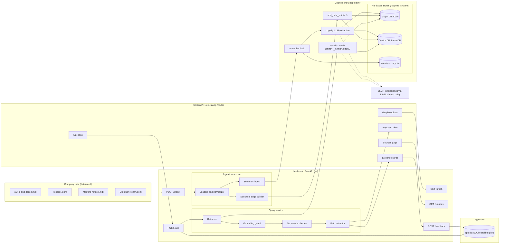
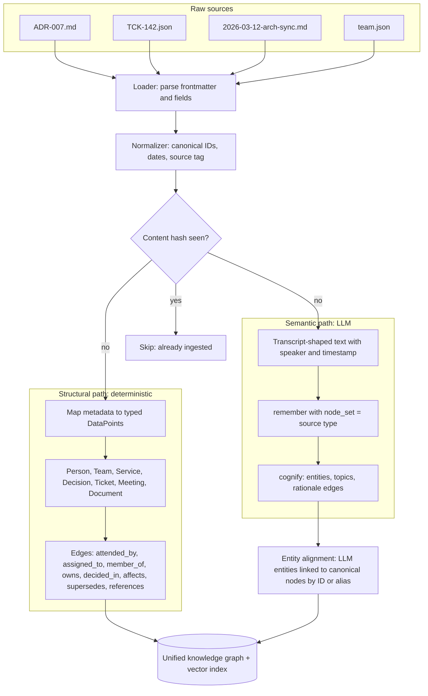
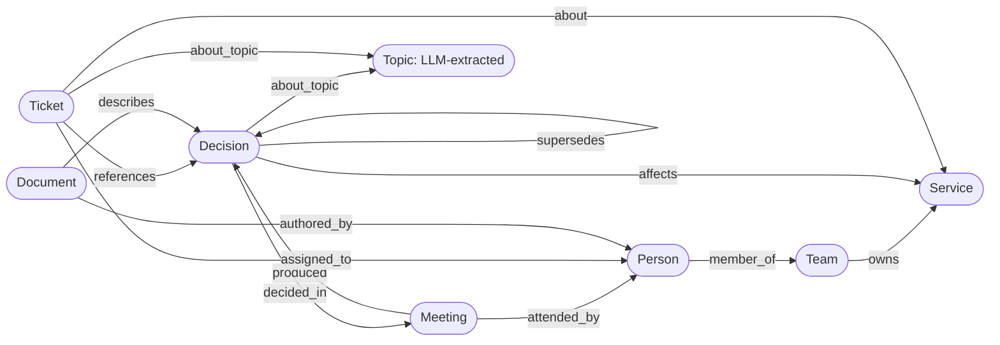
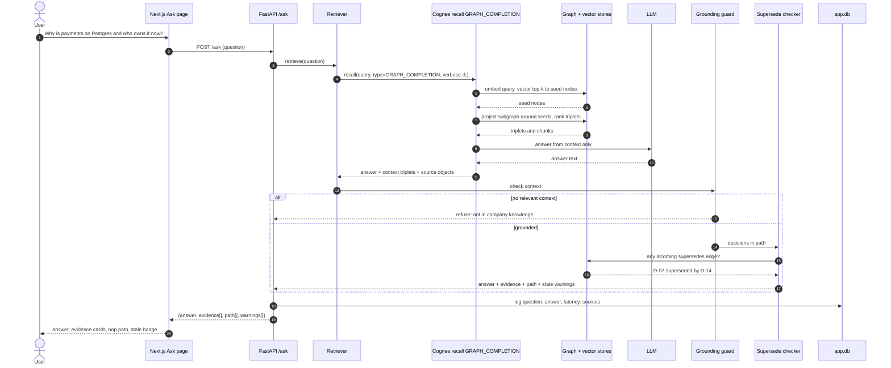
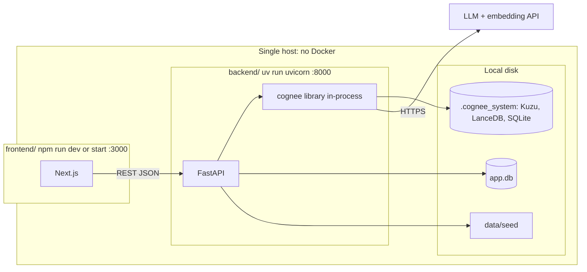
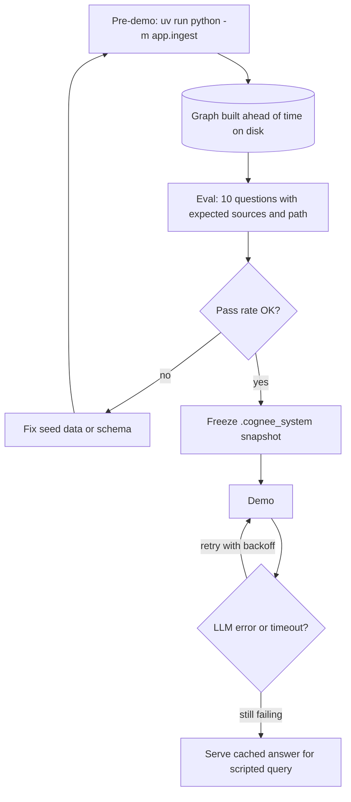

# Decision Brain: Technical Architecture

A mini Company Brain on **Cognee**. It ingests docs, tickets and meeting notes into a hybrid graph+vector knowledge layer and answers natural-language questions with **evidence** and a **visible multi-hop path**.

> **Full diagram:** [`architecture.excalidraw`](architecture.excalidraw) (open at excalidraw.com), with a PNG preview at [`architecture.png`](architecture.png).
>
> **Excalidraw:** every diagram below is a Mermaid `flowchart` or `sequenceDiagram`, the two types Excalidraw's converter supports. In Excalidraw, open **More tools → Mermaid to Excalidraw** and paste a block.
> Items marked ⚠️ are Cognee APIs to confirm against the pinned version before building on them.

---

## 1. System overview



### Components

| Layer | Component | Responsibility |
|---|---|---|
| Data | `data/seed/` | One consistent fictional company with 30–50 items and **canonical IDs** shared across sources |
| Frontend | Next.js App Router | Ask UI, evidence cards, hop-path rendering, graph explorer |
| Backend | FastAPI | HTTP API, ingestion orchestration, query pipeline, grounding rules |
| Knowledge | Cognee | Graph + vector memory, LLM extraction, graph-completion retrieval |
| Stores | Kùzu / LanceDB / SQLite | Cognee's file-based defaults, with zero infrastructure |
| App state | `app.db` (stdlib `sqlite3`) | Q&A history, feedback, eval runs |
| Model | LiteLLM (env vars) | LLM and embedding provider, swappable by config |

---

## 2. Ingestion pipeline (hybrid graph construction)

The core design decision is that **structure comes from metadata and meaning comes from the LLM**. Edges that the multi-hop demo depends on are deterministic, so they cannot be hallucinated.



### Source → graph mapping

| Source | Format | Structural edges (metadata) | Semantic content (LLM) |
|---|---|---|---|
| ADR / docs | Markdown + YAML frontmatter (`id`, `status`, `decided_in`, `affects`, `supersedes`, `owner`) | `Decision -affects-> Service`, `Decision -supersedes-> Decision`, `Decision -decided_in-> Meeting` | Rationale, alternatives, trade-offs |
| Tickets | JSON (`id`, `title`, `assignee`, `service`, `refs`, `status`) | `Ticket -assigned_to-> Person`, `Ticket -about-> Service`, `Ticket -references-> Decision` | Problem description, discussion |
| Meeting notes | Markdown (`date`, `attendees`, `decisions`) | `Meeting -attended_by-> Person`, `Meeting -produced-> Decision` | Who argued what, open questions |
| Org chart | JSON | `Person -member_of-> Team`, `Team -owns-> Service` | none |

---

## 3. Graph schema



`DataPoint` models are pydantic classes subclassing Cognee's `DataPoint` ⚠️, with relationship fields as typed references. Every node carries `id` (canonical), `source`, `source_ref` (file and line/field) and `created_at`, which drive citations.

---

## 4. Query pipeline (`POST /ask`)



### `/ask` response contract

```json
{
  "answer": "Payments moved to Postgres per ADR-007 (decided 2026-03-12). Platform Team owns it; talk to Priya.",
  "evidence": [
    {"source": "adr", "ref": "ADR-007.md", "snippet": "We choose Postgres for ACID..."},
    {"source": "meeting", "ref": "2026-03-12-arch-sync.md", "snippet": "Priya: ..."},
    {"source": "ticket", "ref": "TCK-142", "snippet": "Migrate ledger tables..."}
  ],
  "path": [
    {"from": "Service:payments", "rel": "affected_by", "to": "Decision:ADR-007"},
    {"from": "Decision:ADR-007", "rel": "decided_in", "to": "Meeting:2026-03-12"},
    {"from": "Meeting:2026-03-12", "rel": "attended_by", "to": "Person:priya"},
    {"from": "Person:priya", "rel": "member_of", "to": "Team:platform"}
  ],
  "warnings": [],
  "grounded": true,
  "latency_ms": 2140
}
```

### Retrieval strategy

| Question shape | Cognee mode | Why |
|---|---|---|
| Relational / "who / why / what affects" (default) | `GRAPH_COMPLETION` | Vector-seeded subgraph gives multi-hop context |
| Plain fact lookup | `CHUNKS` / `RAG_COMPLETION` | Cheaper, and graph adds noise |
| Deep chains (3+ hops) | Context-extension / CoT retriever ⚠️ | Iterative expansion, roughly one hop per round |

MVP ships **`GRAPH_COMPLETION` only**. The router is listed under *Next*.

---

## 5. Deployment and runtime



**Config (`backend/.env`):** `LLM_PROVIDER`, `LLM_MODEL`, `LLM_API_KEY`, `EMBEDDING_PROVIDER`, `EMBEDDING_MODEL`, and `ENABLE_BACKEND_ACCESS_CONTROL=false` for a single-user demo. Cognee is configured through env vars, since `set_llm_config()` was removed in 1.2.x.

---

## 6. Reliability design



| Risk | Mitigation |
|---|---|
| Hallucinated answer | Answer only from retrieved context, refuse when there is none, always return evidence |
| Broken multi-hop path | Demo path runs over **deterministic metadata edges**, and canonical IDs avoid entity-resolution errors |
| Ingestion slow or failing live | Graph built before the demo and snapshotted; content-hash dedupe makes re-ingest idempotent |
| LLM rate limits (~7k tokens per graph query) | Paid tier or high-TPM model, retries with backoff, cached fallback for the scripted query |
| Cognee API drift | Pinned version in `uv.lock`, with a thin `app/cognee_client.py` wrapper as the single integration point |
| Stale knowledge | `supersedes` edges produce warnings in the answer |

---

## 7. Scalability path (mentoring round)

| Concern | MVP | Scale-out |
|---|---|---|
| Graph store | Kùzu (embedded) | Neo4j / FalkorDB via Cognee config |
| Vector store | LanceDB (embedded) | pgvector / Qdrant via Cognee config |
| Ingestion | Batch CLI over files | Connectors (Slack, Jira, Git) → queue → incremental ingest by content hash |
| Tenancy / access | Single user | `node_set` / dataset per team, with permission filter at retrieval |
| Cost | LLM extraction per document | Structural edges without LLM calls, LLM only for prose; cache embeddings |
| First bottleneck | LLM extraction throughput and cost | Batch plus a cheaper extraction model, and extract only changed documents |

---

## 8. Repository layout

```
backend/
  pyproject.toml            # uv; cognee pinned
  app/
    main.py                 # FastAPI app and routes
    config.py               # env loading
    cognee_client.py        # the ONLY module importing cognee
    ingest/
      loaders.py            # md/json parsing, normalization, hashing
      models.py             # DataPoint schema (Person, Decision, ...)
      structural.py         # metadata -> DataPoints + edges
      semantic.py           # remember + cognify with node_set
    query/
      ask.py                # retrieve -> guard -> supersede -> path
      paths.py              # triplets -> path[]
    store.py                # sqlite3 app.db (history, feedback)
  eval/
    questions.json          # 10 Qs + expected sources/path
    run_eval.py
frontend/
  src/app/
    page.tsx                # Ask page
    graph/page.tsx          # explorer
    sources/page.tsx
  src/components/
    EvidenceCard.tsx
    HopPath.tsx
data/seed/
  adrs/  tickets/  meetings/  team.json
```

---

## 9. PS requirement traceability

| PS-2 requirement | Where it is satisfied |
|---|---|
| Cognee-powered knowledge layer | §1 Cognee layer, `cognee_client.py` |
| ≥2 types of company information | §2: ADRs, tickets, meeting notes, org chart (4 types) |
| Natural-language Q&A interface | §4 `/ask` and the Ask page |
| Answers grounded in retrieved knowledge | §4 grounding guard and `evidence[]` |
| At least one multi-hop relationship | §3 schema and §4 `path[]` (Service → Decision → Meeting → Person → Team) |
