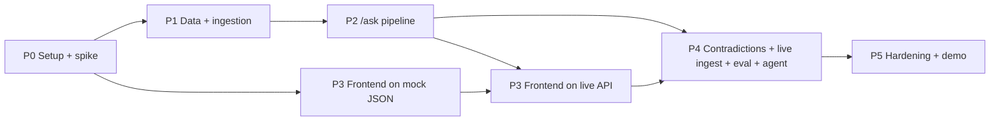

# Decision Brain: Build Plan

> A mini Company Brain on Cognee. It answers **why** a decision was made, **who** owns it now and **what** it affects. It shows evidence and the exact multi-hop path, and **flags stale or contradictory company knowledge**.
>
> Related: [`PS.md`](../PS.md) · [`architecture.md`](architecture.md) · [`architecture.excalidraw`](architecture.excalidraw) · [`research-winning-approaches.md`](research-winning-approaches.md)
>
> Phase files: [`phases/`](phases/)

---

## 1. Goals and success criteria

| # | Goal | Measured by |
|---|---|---|
| G1 | Meet every PS-2 requirement visibly | Completeness checklist (§8) all ✅ in the demo |
| G2 | Answers are grounded and traceable | Every answer shows evidence cards and a hop path; the system refuses when there is no context |
| G3 | Multi-hop is reliable, not luck | The showcase query returns the same 4-hop path 10/10 runs |
| G4 | Differentiator lands in ≤10 s | Live ingest of one meeting triggers a **contradiction alert** on screen |
| G5 | Reliability is measurable | Eval set ≥ 9/10 grounded, 0 hallucinated sources, shown in the UI |
| G6 | Demo never blocks on the LLM | Graph built before the demo, with a cached fallback for the scripted queries |

**Rubric mapping.** Mentoring scores Problem Clarity, Design Decisions, Scalability, Technical Implementation and Scope. Judging scores Production Standards, Technical Understanding, System Architecture, Completeness and Reliability. See [`PS.md`](../PS.md#evaluation).

---

## 2. Workstreams (tracks)

Each track owns a part of the repo. Phases (§3) cut across tracks.

### 2.1 Data track: `data/seed/`
A fictional company, **Acme Pay**, with **canonical IDs shared across every source**. This track makes or breaks the multi-hop story.

| Item | Count | Notes |
|---|---|---|
| People (`team.json`) | ~8 | id, name, aliases (`Priya`, `P. Sharma`), team |
| Teams | 3 | platform, payments-product, data |
| Services | 5 | svc-payments, svc-ledger, svc-auth, svc-notify, svc-reports |
| ADRs (`adrs/*.md`) | 8 | YAML frontmatter; **2 superseded** (ADR-003 → ADR-007, ADR-005 → ADR-009) |
| Tickets (`tickets/*.json`) | ~15 | assignee, service, refs to ADRs |
| Meetings (`meetings/*.md`) | ~8 | attendees, decisions, transcript-style lines |
| **Live-demo file** (`live/MTG-0402.md`) | 1 | **Not pre-ingested.** It proposes DynamoDB for payments, which contradicts active ADR-007. |

### 2.2 Cognee track: `backend/app/cognee_client.py` + `backend/app/ingest/`
- The **only** module that talks to Cognee: a thin httpx client for Cognee Cloud REST (`/api/v1`), so API drift stays in one file.
- Structural ingest: metadata rendered as canonical text triples (`Decision:ADR-007 affects Service:svc-payments.`) via `/add` with `node_set=structural`, then verified in `/graph` after cognify (Cognee Cloud has no custom DataPoints; spike S3).
- Semantic ingest: `POST /add` with `node_set` per source type, then `POST /cognify`.
- Entity alignment: LLM entities → canonical IDs by alias table.
- Retrieval: `POST /search` with `GRAPH_COMPLETION`, `verbose: true` and a fresh `sessionId`, returning `text_result` + `objects_result` triplets.

### 2.3 Backend track: `backend/app/` (FastAPI, uv, stdlib `sqlite3`)
| Endpoint | Purpose |
|---|---|
| `GET /health` | liveness, cognee config, graph stats |
| `POST /ingest` | batch (seed dir) or single upload (live demo) → returns new alerts |
| `POST /ask` | `{question}` → `{answer, evidence[], path[], warnings[], grounded, latency_ms}` |
| `GET /graph` | nodes and edges for the explorer (optional `?focus=<id>&depth=2`) |
| `GET /sources` | every ingested item with hash, type and time |
| `GET /alerts` | contradictions and stale decisions |
| `POST /feedback` | 👍/👎 on an answer |
| `GET /eval/latest` | latest eval run summary |

Modules: `query/ask.py` (retrieve → guard → supersede → path), `query/paths.py`, `analysis/contradictions.py`, `store.py` (app.db).

`app.db` tables: `sources`, `qa_log`, `feedback`, `alerts`, `eval_runs`.

### 2.4 Frontend track: `frontend/` (Next.js 16 App Router, Tailwind 4, npm)
| Route | Content |
|---|---|
| `/` Ask | question box, answer, stale/contradiction banners, evidence cards, hop path, feedback, eval badge |
| `/alerts` | contradiction and stale feed; live-ingest dropzone (demo trigger) |
| `/graph` | graph explorer (**stretch**) |
| `/sources` | ingested items table |

### 2.5 Quality and demo track: `backend/eval/`, `README.md`, pitch
- `eval/questions.json`: 10 questions with expected source refs and path nodes.
- `eval/run_eval.py`: scores grounding (cited refs ⊆ retrieved, expected refs hit) and path correctness, and writes to `eval_runs`.
- Freeze the demo dataset before the demo, cached answers, the demo script, and slides (decision log, architecture, cut list).

---

## 3. Phases

| Phase | Name | Tracks | Est. | Exit gate |
|---|---|---|---|---|
| [P0](phases/phase-0-setup-and-spike.md) | Setup + Cognee spike | Cognee, Backend | 1–1.5 h | Every ⚠️ API confirmed or a fallback chosen |
| [P1](phases/phase-1-data-and-ingestion.md) | Seed data + ingestion | Data, Cognee, Backend | 2–2.5 h | `uv run python -m app.ingest` builds the graph; the showcase path exists in the graph |
| [P2](phases/phase-2-query-pipeline.md) | Query pipeline `/ask` | Cognee, Backend | 2 h | The showcase question returns a grounded answer, evidence, the 4-hop path and a stale warning via curl |
| [P3](phases/phase-3-frontend.md) | Frontend Ask experience | Frontend | 2 h | End-to-end demo in the browser |
| [P4](phases/phase-4-differentiators.md) | Contradictions + live ingest + eval + MCP agent tool | All | 2–2.5 h | Dropping `MTG-0402.md` raises an alert in ≤ 30 s; eval badge shows ≥ 9/10 |
| [P5](phases/phase-5-hardening-and-demo.md) | Hardening, docs, pitch | Quality, All | 1.5 h | Demo rehearsed 3× clean; README and slides done |

> Estimates are focused-work hours for a small team. **Backend and frontend can run in parallel from P2 onward** (frontend builds against the `/ask` contract with a mock JSON).

### Event checkpoints
| When | Must be true |
|---|---|
| **Before mentoring (3:30 PM)** | P0–P3 done; P4 at least contradiction detection working via curl. Slides: problem, architecture, decision log, cut list. |
| **Mentoring (3:30–4:30)** | 5-min pitch focused on **design decisions, scalability, scope**. Write down every mentor question. |
| **4:30–5:00** | Fold in mentor feedback (small changes only), finish P5 rehearsal, freeze the graph snapshot. |
| **Judging (5:00–6:00)** | 1-min pitch, 2-min demo (script in P5), 2-min Q&A. |

---

## 4. Key design decisions (for the decision-log slide)

| # | Decision | Alternative rejected | Why |
|---|---|---|---|
| D1 | **Hybrid graph**: structural edges generated from metadata (canonical triples, verified in `/graph`) + `cognify` LLM edges | Pure `cognify` | Entity-resolution errors compound per hop (85% per hop → 44% at 5 hops). The demo path must be checked, not hoped for. |
| D2 | Cognee as the knowledge layer | Plain vector RAG | Vector search cannot follow Decision → Meeting → Person → Team |
| D3 | Cognee Cloud (managed stores + model) + SQLite `app.db` | Local Kùzu / LanceDB | No infra to run; the local SDK was spiked as a fallback |
| D4 | `node_set` per source type | One undifferentiated dataset | Provenance, filtering, a future per-team access path |
| D5 | Grounded-or-refuse | Always answer | A wrong answer delivered confidently is the core risk of a company brain |
| D6 | Contradiction = deterministic candidates (same service, active decision) + LLM judge | LLM compares everything | Bounded cost O(new × related), explainable, testable |
| D7 | One wrapper module for cognee | cognee calls everywhere | REST and SDK drift (the 1.6.0 SDK cloud client drops `node_set` / `sessionId`) is isolated to one file |
| D8 | App state in stdlib `sqlite3` | ORM / Postgres | Repo convention; the prototype scale fits |

---

## 5. Scope

| MVP (must) | Stretch (if time) | Cut (say so in the pitch) |
|---|---|---|
| 4 source types, canonical IDs | Graph explorer page | Real Slack/Jira connectors |
| Hybrid ingest, hash dedupe | Retrieval router (CHUNKS vs GRAPH) | Auth / permissions |
| `/ask` with evidence, path, stale warning, refusal | Multi-turn chat memory | Graph editing UI |
| Contradiction detection + live ingest | `memify` / feedback-driven refinement | Cloud deploy with autoscaling |
| Eval set + badge | Deployed URL | Voice or other extra modalities |
| Graph built before the demo + cached fallback | | |

---

## 6. Risk register

| Risk | Likelihood | Impact | Mitigation | Owner phase |
|---|---|---|---|---|
| ~~Cognee API differs from the docs~~ **Resolved in P0**: REST verified; no custom DataPoints in cloud → text triples | High | High | P0 spike | P0 |
| `cognify` slow or rate-limited | Med | High | Tenant-managed model; build the graph before the demo; live ingest is only 1 small file | P1, P5 |
| LLM entities don't align with canonical IDs | Med | Med | Alias table + normalization; the path relies on the verified structural edges | P1 |
| Answer text ignores the stale decision | Med | Med | Supersede check is **post-retrieval code**, not a prompt; warnings are always attached | P2 |
| Contradiction false positives | Med | Med | Only compare against the same service + active decisions; LLM judge returns a reason; demo file is crafted | P4 |
| Demo network or LLM failure | Low | High | Cached answers for the 3 scripted queries; a recorded backup video | P5 |
| Frontend blocked on the backend | Med | Med | Contract-first: mock JSON in `frontend/src/lib/mock.ts` | P3 |

---

## 7. Demo script (2 minutes, judging round)

1. **(15 s)** Ask *"Why is payments on Postgres, and who should I talk to about it now?"* → answer, 3 evidence cards, 4-hop path, **STALE** badge (ADR-003 was superseded).
2. **(15 s)** Ask *"What's our Kafka strategy?"* → **refuses**: "not in company knowledge". Point out that it never guesses.
3. **(40 s)** Go to Alerts and drop `MTG-0402.md` (a new meeting proposing DynamoDB for payments). Ingest runs → a **contradiction alert** appears: *"MTG-0402 contradicts active ADR-007 (Postgres for ACID). Raised by Arjun; owner Priya."*
4. **(20 s)** Re-ask the first question → the answer now carries the contradiction warning.
5. **(20 s)** Open the eval badge → **raw Cognee vs Decision Brain** on the same 10 questions (grounded, stale flagged, refusals). This is the "not just a wrapper" answer. Then the architecture slide.
6. **(10 s)** Buffer.

---

## 8. Definition of done (PS-2 completeness)

- [ ] Cognee-powered knowledge layer (`cognee_client.py`, graph in the Cognee Cloud dataset)
- [ ] ≥2 types of company information (ADRs, tickets, meetings, org chart = 4)
- [ ] Natural-language Q&A interface (`/` Ask page)
- [ ] Answers grounded in retrieved knowledge (evidence cards, refusal path)
- [ ] ≥1 multi-hop relationship demonstrated (4-hop path rendered)
- [ ] Differentiator: contradiction + stale detection live
- [ ] Eval ≥ 9/10 and shown in the UI, next to the raw-Cognee baseline on the same questions
- [ ] Agent access: MCP tool `ask_company_brain` wraps `/ask` (PS-2 Challenge: humans, agents, and applications)
- [ ] README: one-command setup, architecture diagram, decision log
